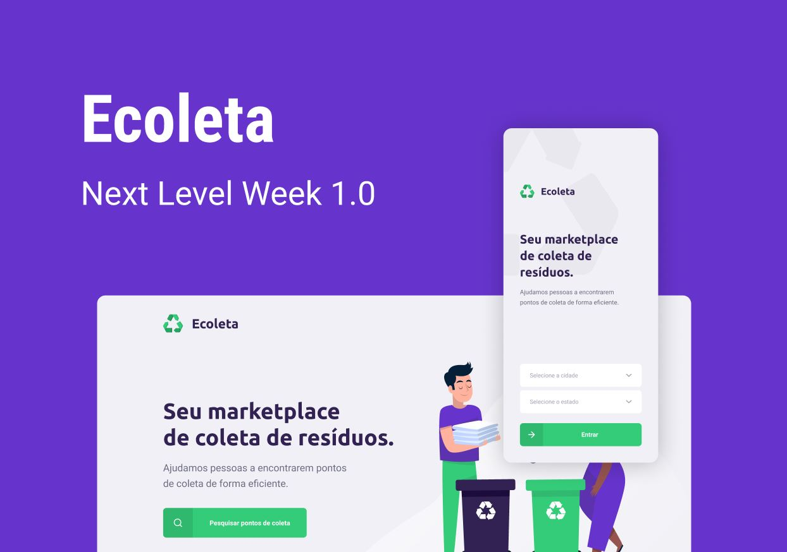

# Ecoleta - Sobre

Ecoleta é uma aplicação voltada para o auxílio de localização de pontos de coletas de resíduos. A mesma foi desenvolvido em um evento junto a [Rocktseat](https://rocketseat.com.br/)/[Github](https://github.com/Rocketseat) para aprimorar alguns conhecimentos ja adquiridos e para aquisições de novos conhecimentos.

## Tecnologia utilizadas

### Back-End
- NodeJS
- Express
- TypeScript
- QueryBuilder: Knex
- DB: SQLite
- Multer (Para uploads de arquivos)
- Celebrate, Joi (Para tratamento de dados)

### Front-End
- ReactJS (useEffect, useState, useCallback, ChangeEvent, FormEvent , React-Icons, React-Dropzone)
- TypeScript
- Axios (Para requisições)

### Mobile
- React Native
- Expo
- Expo Fonte
- TypeScript
- Axios (Para requisições)
- React Navigation (Para navegações de rotas)
- React Native Maps (Para utilização de mapa)
- React Native SVG (Para utilização de arquivos SVG)
- Expo Location (Trabalhar com a localização do usuário)
- React Native Picker Select (Criação do select )

### Clonado e iniciando o projeto
1. Realizar o clone do repositório.
2. Navegar até a pasta **server** através do Terminal/CMD/Git Bash e rodar **_"npm install"_** ou **_""yarn""_**
3. Ainda na pasta **server** rodar o comando **_"npm run dev"_** ou **_"yarn dev"_**
4. Em outro Terminal/CMD/Git Bash navegar até a pasta **web** e rodar **_"npm install"_** ou **_"yarn"_**
5. Ainda na **web** rodar o comando **_"npm start"_** ou **_"yarn start"_**
_(Caso ja tenha instalado o expo como global pular para o passo 7)_
6. Em outro Terminal/CMD/Git rodar o comando **_npm install -g expo-cli_**
7. Navegar até a pasta **mobile** e rodar **_"npm install"_** ou **_"yarn"_** (Obs. em outro terminal ou caso tenha executado o passo 6, no mesmo terminal do passo 6)
7. Ainda na **mobile** rodar o comando **_"npm start"_** ou **_"yarn start"_**
8. Baixar Expo Client na loja de app's do seu smartphone e estando na mesma rede, basta logar com login e senha tanto no terminal que tenha iniciado o expo, quanto no app do seu smartphone e iniciar o projeto.